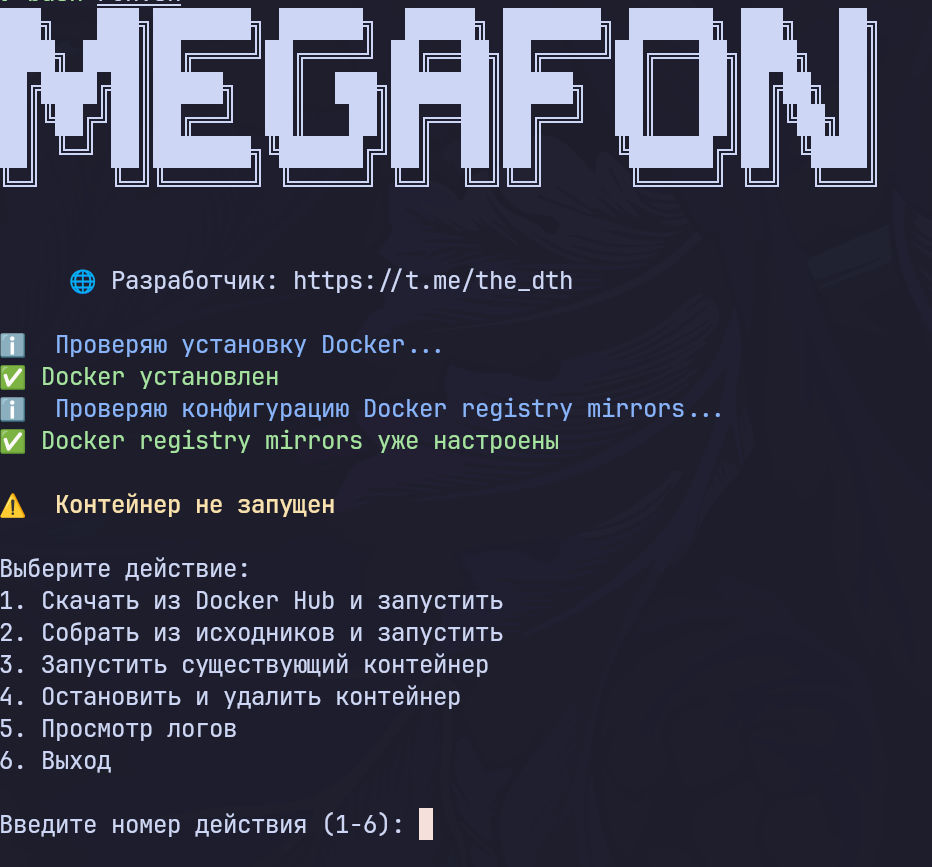
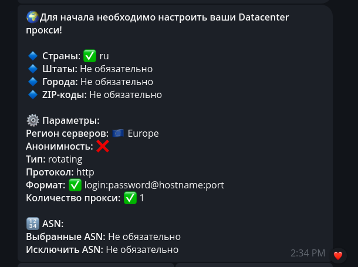

# Megafon Helper

Бот для управления дополнительными номерами Мегафон через Telegram бота.
Вход в аккаунт Megafon по номеру телефона и коду из смс.
Для тех, кто не понимает что такое дополнительные номера и зачем они нужны - [доп номера](#дополнительные-номера)

||| [📎Скриншоты](#скриншоты) | [🚀Старт](#быстрый-старт) | [📃Описание проекта](#описание-проекта) |[📋Требования](#что-нужно-для-использования) |||

## Разработчик
- 🌐 Telegram: https://t.me/the_dth

## Описание проекта
Весь проект асинхронный. Используются чистые запросы(никаких selenium и т.п.), но скорость работы все равно очень малая(5 с. на получение баланса и активных номеров) из за прокси и мощнейших серверов Megafon.
База данных: sqlite

Стек:
- aiogram 3+
- aiohttp
- aiosqlite

## Что нужно для использования
- Подойдет самый нищенский сервер на Ubuntu (1гб RAM, 1 vCore, 10гб storage) 
- Токен бота
- [Прокси (обязательно к прочтению!)](#прокси)

## Быстрый старт

### 1. Установка и первый запуск
```bash
bash -c "$(curl -fsSL https://raw.githubusercontent.com/kashsuzu/megafon_helper/master/run.sh)"
```

Скрипт автоматически:
- Установит себя в `/usr/local/bin/megafonHelper` для запуска отовсюду
- Проверит наличие Docker (установит если нужно)
- Запросит токен Telegram бота
- Соберет Docker образ или загрузит его с Docker Hub
- Запустит контейнер с приложением

### 2. Повторный запуск
```bash
megafonHelper
```

## Скриншоты



## Синхронизация данных
**database.db**  и **logs.log** - синхронизируются в папке `megafon_helper_data/`

Папка автоматически монтируются в контейнер и синхронизируются с хостом. Поэтому логи и бд никогда не будут потеряны.

## Прокси
Лучше всего использовать ротационные datacenter прокси, так как cooldown на запросы был намеренно убран для повышения скорости ответа. Если использовать статичные прокси, то есть большая вероятность уйти во временный бан по IP. Также предупреждаю, что резидентские прокси могут работать крайне нестабильно(по крайней мере у меня они очень плохо работали с мегафоном)
*За работоспособность бота при использовании других прокси не ручаюсь.*

Проверенные и подходящие прокси: VProxy [реф. ссылка](https://t.me/V_Proxy_bot?start=_tgr_-nLdbYhjYjA6) | [ссылка](https://t.me/V_Proxy_bot). Там есть ротационные DC прокси, которые очень хорошо подходят для стабильной работы. (не реклама)



## Дополнительные номера
Это название услуги в Мегафоне, которая позволяет взять 3 виртуальных номера (выглядят как обычные номера) раз в 24 часа. На эти номера приходят СМС и звонки. Тем кому очень надо больше 3 номеров в сутки могут зарегать несколько есимов Мегафон, а бот поможет удобно управлять этими доп. номерами без монотонной ручной активации. Эта услуга появилась на фоне ухода SMS activate и прочих сервисов. 


