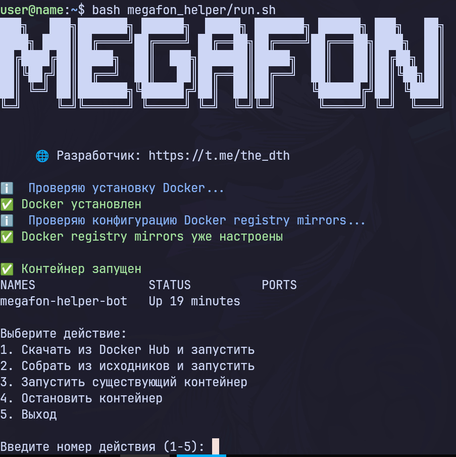

# Megafon Helper

Бот для управления дополнительными номерами Мегафон через Telegram бота.
Для тех, кто не понимает что такое дополнительные номера и зачем они нужны - [доп номера](#дополнительные-номера)

||| [📎Скриншоты](#скриншоты) | [🚀Старт](#быстрый-старт) | [📋Требования](#что-нужно-для-использования) |||

## Разработчик
- 🌐 Telegram: https://t.me/the_dth

## Что нужно для использования
- Подойдет самый нищенский сервер на Ubuntu (1гб RAM, 1 vCore, 10гб storage) 
- Токен бота
- [Прокси (обязательно к прочтению!)](#прокси)

## Быстрый старт

### 1. Установка и первый запуск
```bash
bash -c "$(curl -fsSL https://raw.githubusercontent.com/kashsuzu/megafon_helper/master/run.sh)"
```

Скрипт автоматически:
- Установит себя в `/usr/local/bin/megafonHelper` для запуска отовсюду
- Проверит наличие Docker (установит если нужно)
- Запросит токен Telegram бота
- Соберет Docker образ или загрузит его с Docker Hub
- Запустит контейнер с приложением

### 2. Повторный запуск
```bash
megafonHelper
```

### 3. Просмотр логов
```bash
docker logs -f megafon-helper-bot
```

## Скриншоты



## Синхронизация данных
**database.db**  и **logs.log** - синхронизируются в папке `data/`

Папка автоматически монтируются в контейнер и синхронизируются с хостом. Поэтому логи и бд никогда не будут потеряны.

## Прокси
Лучше всего использовать ротационные datacenter прокси, так как cooldown на запросы был намеренно убран для повышения скорости ответа. Если использовать статичные прокси, то есть большая вероятность уйти во временный бан по IP. Также предупреждаю, что резидентские прокси могут работать крайне не стабильно(по крайней мере у меня они очень плохо работали с мегафоном)

Лично я использую прокси от VProxy [реф. ссылка](https://t.me/V_Proxy_bot?start=_tgr_-nLdbYhjYjA6) [просто ссылка](https://t.me/V_Proxy_bot). Там есть ротационные DC прокси, которые очень хорошо подходят для работы этого бота. (не реклама)


## Дополнительные номера
Это название услуги в Мегафоне, которая позволяет взять 3 виртуальных номера (выглядят как обычные номера) раз в 24 часа. На эти номера приходят СМС и звонки. Тем кому очень надо больше 3 номеров в сутки могут зарегать несколько есимов Мегафон, а бот поможет удобно управлять этими доп. номерами без монотонной ручной активации. Эта услуга появилась на фоне ухода SMS activate и прочих сервисов. 

## Переменные окружения
- `BOT_TOKEN` - Токен Telegram бота (передается автоматически через run.sh)

## Управление контейнером

### Просмотр статуса
```bash
docker ps -a | grep megafon-helper
```

### Остановка контейнера
```bash
docker stop megafon-helper-bot
```

### Запуск контейнера
```bash
docker start megafon-helper-bot
```

### Удаление контейнера
```bash
docker rm megafon-helper-bot
```


